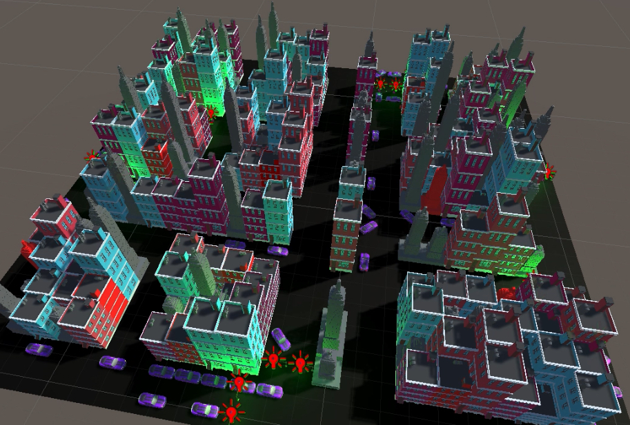

# LuciaBarrenechea
Hello! This repository contains some of the most interesting projects I've worked on the past few years. 
In the following links you can find bigger projects that have their own repository.

### Traffic Simulation
THe following repository contains a simulation developed in python using the mesa.
[MultiAgents Repository](https://github.com/FerOsorio08/Multiagentes_equipo06)

### Videogame
The following repository contains a videogame called "Wings of Glory the Pegasus Chronicles" developed in unity.
[Videogame Repository](https://github.com/emosl/ChicasUnicornio)

[Explanation Video Youtube](https://www.youtube.com/embed/eHCh55CjSJA)

### React-Admin Platform
The following repository contains a platform developed using react-admin and mongodb. It's a dedicated platform tailored for "Fundación por México," enabling them to efficiently manage and address any issues encountered across their facilities.
[React-admin Repository](https://github.com/fernicortlo/react_TC2007B)

